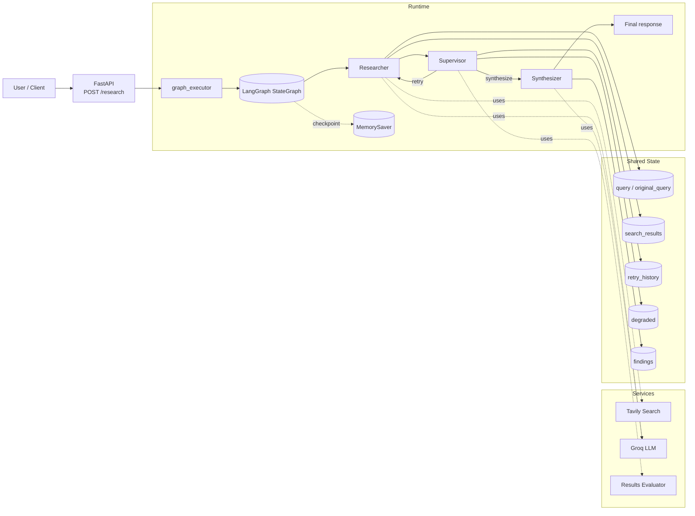

# Multi-Agent Research Assistant

## Flow

1. The client sends a query to the FastAPI `/research` endpoint.
2. `graph_executor` builds the LangGraph and initializes state.
3. `researcher` runs Tavily search, refines the query when retries are needed, and stores search results.
4. `supervisor` evaluates result quality and decides whether to retry or synthesize.
5. `synthesizer` generates the final findings from the collected search results.
6. The API returns the findings, search results, degraded flag, and retry history.

## Key State

- `query`: current search query
- `original_query`: original user request
- `search_results`: Tavily results collected so far
- `retry_history`: feedback used to refine retries
- `degraded`: whether the graph hit its retry limit
- `findings`: final synthesized report
