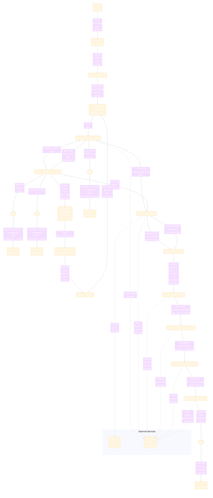

```mermaid
%%{init: {
  "theme": "base",
  "themeVariables": {
    "fontSize": "50px",
    "primaryTextColor": "#FFFFFF",
    "lineColor": "#1f2937",
    "fontFamily": "Segoe UI"
  },
  "flowchart": {
    "nodeSpacing": 260,
    "rankSpacing": 320,
    "diagramPadding": 80,
    "padding": 20,
    "curve": "basis",
    "htmlLabels": true
  }
}}%%
flowchart TB
  U[Client<br/>User] -->|POST /research<br/>with query| API1[FastAPI<br/>/research]
  API1 -->|create thread_id<br/>and invoke| EX[graph_executor]
  EX -->|build initial AgentsState<br/>and run graph| SG[LangGraph StateGraph<br/>MemorySaver]

  SG -->|START edge| QC[query_classifier_agent]
  QC -->|is_valid true<br/>requires_approval false| R[researcher_agent]
  QC -->|requires_approval true| HA[human_approval_agent]
  QC -->|invalid or malformed query| END0([END])

  HA -->|interrupt action approve| R
  HA -->|interrupt action edit<br/>with edited_query| QC
  HA -->|interrupt action reject| END1([END])
  HA -->|approval_history >= 3| END2([END])

  END0 -->|executor returns completed<br/>with termination_reason| RESP0[API response]
  END1 -->|executor returns completed<br/>with termination_reason| RESP1[API response]
  END2 -->|executor returns completed<br/>with termination_reason| RESP2[API response]

  HA -->|pause graph via interrupt payload| INT[status interrupted<br/>thread_id interrupt]
  INT -->|POST /research/resume| API2[FastAPI<br/>/research/resume]
  API2 -->|validate action<br/>approve reject edit| RES[resume_graph]
  RES -->|Command resume<br/>with thread_id| SG

  R -->|invoke Tavily and update<br/>search_results| SUP[supervisor_agent]
  SUP -->|evaluate_results low quality<br/>and retries left| R
  SUP -->|quality pass or retry cap reached<br/>set degraded if needed| SC[source_critic_agent]

  SC -->|filter weak sources and keep<br/>raw_search_results| EE[evidence_extractor_agent]
  EE -->|chunked extraction to<br/>evidence_extracted| CD[conflicts_analysis_agent]
  CD -->|produce conflicts_analysis<br/>JSON string| RW[report_writer_agent]
  RW -->|generate final findings report| END3([END])
  END3 -->|executor returns completed payload| RESP3[API response]

  subgraph EXT[External Services]
    TV[Tavily Search API]
    LLM[Groq LLM / ChatGroq]
  end

  R -. search query to web .-> TV
  QC -. classification prompt .-> LLM
  R -. retry query rewrite prompt .-> LLM
  SC -. source quality verdict prompt .-> LLM
  EE -. evidence extraction prompts .-> LLM
  CD -. conflict analysis prompt .-> LLM
  RW -. long report generation prompt .-> LLM
```
