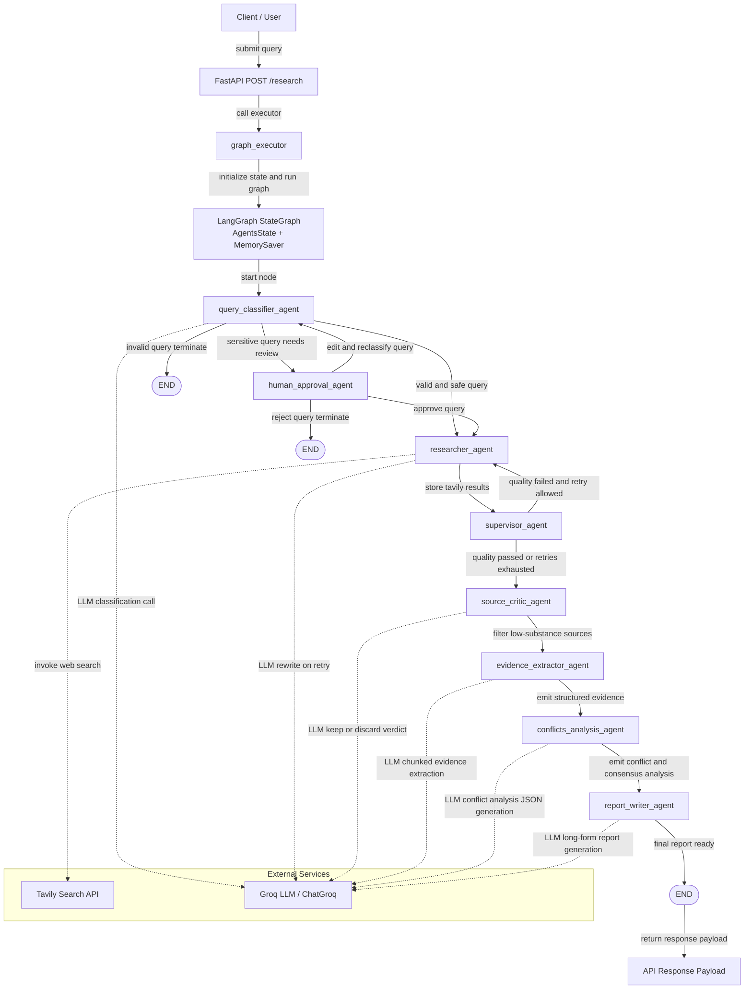

```mermaid
flowchart TB
  U[Client / User] -->|submit query| API[FastAPI POST /research]
  API -->|call executor| EX[graph_executor]

  EX -->|initialize state and run graph| G[LangGraph StateGraph<br/>AgentsState + MemorySaver]

  G -->|start node| QC[query_classifier_agent]
  QC -->|valid and safe query| R[researcher_agent]
  QC -->|sensitive query needs review| HA[human_approval_agent]
  QC -->|invalid query terminate| END0([END])

  HA -->|approve query| R
  HA -->|edit and reclassify query| QC
  HA -->|reject query terminate| END1([END])

  R -->|store tavily results| S[supervisor_agent]
  S -->|quality failed and retry allowed| R
  S -->|quality passed or retries exhausted| SC[source_critic_agent]

  SC -->|filter low-substance sources| EE[evidence_extractor_agent]
  EE -->|emit structured evidence| CD[conflicts_analysis_agent]
  CD -->|emit conflict and consensus analysis| RW[report_writer_agent]
  RW -->|final report ready| END2([END])

  END2 -->|return response payload| RESP[API Response Payload]

    subgraph EXT[External Services]
      TV[Tavily Search API]
      LLM[Groq LLM / ChatGroq]
    end

    R -. invoke web search .-> TV
    QC -. LLM classification call .-> LLM
    R -. LLM rewrite on retry .-> LLM
    SC -. LLM keep or discard verdict .-> LLM
    EE -. LLM chunked evidence extraction .-> LLM
    CD -. LLM conflict analysis JSON generation .-> LLM
    RW -. LLM long-form report generation .-> LLM
```
